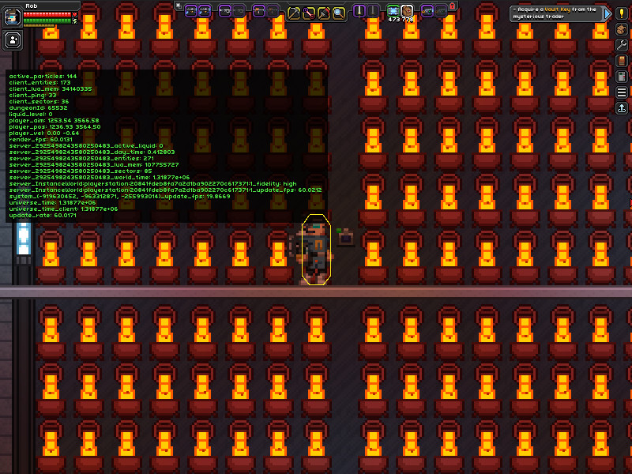

# Status Effect Objects Modder's Guide

This guide documents how to configure objects to project status effects across an area. There are two primary ways to achieve this: static status effect objects, and dynamic status effect objects. In general, static objects have better performance and should be preferred over dynamic objects whenever reasonable.

## Static Status Effect Objects

The first section deals with adding status effects to static objects, that is, to objects that are always on. This can be done without writing any Lua code, using only the built-ins provided by the base game's core engine. Its impact on game performance appears to be negligible.

### Status Effects

An object may apply zero or more status effects by configuring the optional `statusEffects` parameter of its object file. If this parameter is specified, it takes a JSON list of status effects. Status effects must be either a string naming a unique status effect, or a stat modifier.

In the first example, the object applies both deadly radiation and deadly chill:
```
  "statusEffects" : ["biomeradiation", "biomecold"]
```

In the second example, the object applies a stat modifier granting immunity to deadly chill:
```
  "statusEffects" : [{"stat" : "biomecoldImmunity", "amount" : 1.0}]
```

### Status Effect Area

If only the `statusEffects` list is given, the status effects apply only when the player's collision polygon collides with the object's bounding box. How can an object project a status effect? To do this, we use the `statusEffectArea` parameter of an object's orientations. As far as I know, this parameter is not documented anywhere else, and I only learned about it after examining the source code published by OpenStarbound. However, testing shows that the parameter exists in the base game as well.

Objects have an `orientations` list that consists of one or more orientations, each giving properties of the image and animations for orientations such as "left", "right", "top", "bottom", etc. One of the properties of an orientation that the core engine will accept is `statusEffectArea`. This parameter, if given, takes a list of relative coordinates with respect to the object's position and establishes a polygon around the object. The core engine then applies any specified status effects when the player's collision polygon collides with this polygon.

This example shows a 16-sided polygon circumscribed inside a circle of radius 10:
```
  ... snip ...

  "orientations" : [
    {
      ... snip ...

      "statusEffectArea" : [[10.0, 0.0], [9.1875, 3.8125], [7.0625, 7.0625], [3.8125, 9.1875], [0.0, 10.0], [-3.8125, 9.1875], [-7.0625, 7.0625], [-9.1875, 3.8125], [-10.0, 0.0], [-9.1875, -3.8125], [-7.0625, -7.0625], [-3.8125, -9.1875], [0.0, -10.0], [3.8125, -9.1875], [7.0625, -7.0625], [9.1875, -3.8125]]
    }
  ],

  ... snip ...
```

Logically, the polygon should be centered around the "source" of the status effect, i.e., a fire, for a heat-generating object. This origin will change from object to object, based on the object's images, and may also change among the orientations of a single object. A second example shows both the left and right orientation status effect areas for the [cascading lava tank](https://starbounder.org/Cascading_Lava_Tank) in this mod. The area consists of a 16-sided polygon circumscribed inside a circle of radius 20, with the left orientation centered around `[1.5, 5]` and the right orientation centered around `[-1, 5]`:
```
  ... snip ...

  "orientations" : [
    {
      ... snip ...

      "statusEffectArea" : [[21.5, 5.0], [19.9375, 12.625], [15.625, 19.125], [9.125, 23.4375], [1.5, 25.0], [-6.125, 23.4375], [-12.625, 19.125], [-16.9375, 12.625], [-18.5, 5.0], [-16.9375, -2.625], [-12.625, -9.125], [-6.125, -13.4375], [1.5, -15.0], [9.125, -13.4375], [15.625, -9.125], [19.9375, -2.625]]
    },
    {
      ... snip ...

      "statusEffectArea" : [[19.0, 5.0], [17.4375, 12.625], [13.125, 19.125], [6.625, 23.4375], [-1.0, 25.0], [-8.625, 23.4375], [-15.125, 19.125], [-19.4375, 12.625], [-21.0, 5.0], [-19.4375, -2.625], [-15.125, -9.125], [-8.625, -13.4375], [-1.0, -15.0], [6.625, -13.4375], [13.125, -9.125], [17.4375, -2.625]]
    }
  ],

  ... snip ...
```

Note that any polygon could be used, but in general I tend to choose an equilateral convex 16-sided polygon because it reasonably simulates a circle. Fractional coordinates, when used, are multiples of `1/16` to ensure pixel-perfect precision.

### Meta Bounding Box

If only the `statusEffects` and `statusEffectArea` are given, the player still must come very close to touching an object before being affected by its status effects. This is due to the core engine's concept of a meta bounding box. While the concept is not discussed explicitly in Starbound source code comments or documentation, given its use, I infer that the meta bounding box defines a sort of outer limit of an object's effects. It seems to be used by the core engine to establish a fuzzy collision detection, after which more detailed collision detection is performed to see if a collision actually happened. It also seems to help the core engine decide when to retain an object whose image is off-screen, but whose effects may still affect the visible area.

By default, the meta bounding box of an object extends one block in all directions past the bounding box around the object's image. This default can be overridden by an object's orientations, very similarly to the `statusEffectArea` parameter. In this case, the parameter is called `metaBoundBox`, and if given, it must be a four integer list defining the lower and upper bounds of a rectangle. For our purposes, the meta bounding box must be large enough to fully enclose the polygon given in the `statusEffectArea` parameter, and is also assumed to be large enough to fully enclose the original, default, meta bounding box. Unlike those of the polygon, each numeric value of the meta bounding box must be an integer, so the meta bounding box's sides may extend past the extreme vertices of the polygon.

The following is an example taken from the cascading lava tank:
```
  ... snip ...

  "orientations" : [
    {
      ... snip ...

      "statusEffectArea" : [[21.5, 5.0], [19.9375, 12.625], [15.625, 19.125], [9.125, 23.4375], [1.5, 25.0], [-6.125, 23.4375], [-12.625, 19.125], [-16.9375, 12.625], [-18.5, 5.0], [-16.9375, -2.625], [-12.625, -9.125], [-6.125, -13.4375], [1.5, -15.0], [9.125, -13.4375], [15.625, -9.125], [19.9375, -2.625]],
      "metaBoundBox" : [-19, -15, 22, 25]
    },
    {
      ... snip ...

      "statusEffectArea" : [[19.0, 5.0], [17.4375, 12.625], [13.125, 19.125], [6.625, 23.4375], [-1.0, 25.0], [-8.625, 23.4375], [-15.125, 19.125], [-19.4375, 12.625], [-21.0, 5.0], [-19.4375, -2.625], [-15.125, -9.125], [-8.625, -13.4375], [-1.0, -15.0], [6.625, -13.4375], [13.125, -9.125], [17.4375, -2.625]],
      "metaBoundBox" : [-21, -15, 19, 25]
    }
  ],

  ... snip ...
```

With `statusEffects`, `statusEffectArea`, and `metaBoundBox` appropriately defined, objects can project status effects to arbitrary distances in the world.

### Limitations of Static Status Effect Objects

Static status effect objects are very efficient, but there is a drawback. The effects are fixed at object placement and are active from the moment the object is placed until it is removed. The core engine provides no method for altering effects in-place, or switching them on and off. As such, I chose not to add status effects using this method to switchable objects that should provide warmth only when on, such as the [medieval fireplace](https://starbounder.org/Medieval_Fireplace). Doing so would cause the logical inconsistency of such objects creating warmth even when they were off.

The next section explores methods to add status effects to dynamic objects.

## Dynamic Status Effect Objects

Many game objects are dynamic, that is, they have multiple states. The simplest examples of such objects are lights, which can be switched on and off. For most such objects, the object should provide a status effect only when it is on. An example of this is the [medieval fireplace](https://starbounder.org/Medieval_Fireplace), which is a light source with a wired input node. When the object's input is connected and off, the fire goes out. This object should provide warmth when the fire is on, but should not provide warmth when the fire is off.

The [Dynamic Status Effect Objects](README_dynamic.md) mod (which requires the [Status Effect Objects](README.md) mod) provides an extension to the player's status controller that efficiently finds nearby dynamic status effect objects that are in the "on" state and applies the relevant status effects. The mod also provides a Lua [light script](https://github.com/rl-starbound/rl_statuseffectobjects/tree/main/rl_statuseffectobjects_dynamic/objects/scripts/rl_statuseffectobjects_light.lua) for controlling the status effects of light-type objects.

*For objects requiring more complex state transitions, you will need to implement your own script using the light script as an example.*

### Status Effects

To make use of dynamic status effects in light-type objects, first you must append the [light script](https://github.com/rl-starbound/rl_statuseffectobjects/tree/main/rl_statuseffectobjects_dynamic/objects/scripts/rl_statuseffectobjects_light.lua) to the object's `scripts` list:

```
  "scripts" : [
    ... snip (already existing script files) ...,

   "/objects/scripts/rl_statuseffectobjects_light.lua"
  ],
```

To use the base game's static status effects, an object defines one or more status effects in its `statusEffects` parameter. Dynamic status effect objects MUST NOT define this parameter, or it must be an empty list. Instead, to make use of dynamic status effects, the object must define the `rlDynamicStatusEffects` parameter. Like in the static case, this parameter takes a JSON list of status effects. Status effects must be either a string naming a unique status effect, or a stat modifier. The syntax is identical to `statusEffects`:

```
  "rlDynamicStatusEffects" : [{"stat" : "biomecoldImmunity", "amount" : 1.0}]
```

To define the dynamic status effect's area, you must define both `statusEffectArea` and `metaBoundBox` in the object's orientations in exactly the same way as for the static status effect's area. Just like for static status effects, if you do not define a `statusEffectArea` or a `metaBoundBox` for an orientation, the object defaults to using its bounding box as its status effect area when in that orientation.

The player's status controller extension provided by this mod periodically checks for any objects near the player that have the `rlActiveStatusEffects` parameter. If defined, this parameter contains a status effects list and a collision polygon. If the player's position is within the collision polygon, the status effects are applied to the player. The light script provided by this mod ensures that the `rlActiveStatusEffects` parameter contains the contents of `rlDynamicStatusEffects` and `statusEffectArea` when the object is on, and ensures that the parameter is set to nil when the object is off.

*If you implement your own Lua script for controlling dynamic status effects in your objects, you must ensure that it sets the `rlActiveStatusEffects` parameter to an appropriately-defined JSON structure containing a status effects list and a collision polygon when the object should provide status effects, or to nil when the object should provide no effects.*

### Performance of Dynamic Status Effect Objects

The [Dynamic Status Effect Objects](README_dynamic.md) mod re-implements in Lua the core engine's algorithm for applying status effects via objects. The Lua code has equivalent (actually, slightly less) complexity compared to the core engine's algorithm, so performance should be reasonable. That said, Lua is fundamentally slower than C++, so there will be a performance penalty. After extensive testing, I haven't noticed any significant performance loss, but I imagine that given some extreme arrangements of very large numbers of very small dynamic status effect objects packed closely together, lag could be possible.

As an experiment, I built an array of 144 [foundry lights](https://starbounder.org/Foundry_Light) packed together as closely as possible, so that at any given time, the player's bounding box was colliding with at least 40 of them.



Even given this silly scenario, I wasn't able to notice any significant frame drops while running around the lights, except for when I flipped the switch from off to on. That briefly dropped a noticeable amount of frames as all 144 lights ran their state update code at once. To be thorough, I uninstalled the Dynamic Status Effect Objects mod and ran the test again, and a comparable amount of frames were lost running only the base game code, indicating that the dominating factor is not my code, but the animation and/or light-rendering code.

## Miscellanous

Several utilities are provided with this mod for the convenience of developers.

### Automatic Generation of Polygons

Hand-crafting the polygons and bounding boxes for status effect areas is time consuming. I provide the [generate\_polygon.py](generate_polygon.py) script to automate this for an equilateral convex n-sided polygon inscribed within a circle of arbitrary radius around an origin. It can be used as such:
```
python3 generate_polygon.py originX originY radius cardinality
```
where `originX` and `originY` are real numbers, `radius` is a positive real number greater than or equal to 1, and `cardinality` is a positive integer greater than or equal to 3. For example, to calculate the parameters of the cascading lava tank's right orientation:
```
python3 statuseffectarea.py -1 5 20 16
```

This results in two lines of text output:
```
[[19.0, 5.0], [17.4375, 12.625], [13.125, 19.125], [6.625, 23.4375], [-1.0, 25.0], [-8.625, 23.4375], [-15.125, 19.125], [-19.4375, 12.625], [-21.0, 5.0], [-19.4375, -2.625], [-15.125, -9.125], [-8.625, -13.4375], [-1.0, -15.0], [6.625, -13.4375], [13.125, -9.125], [17.4375, -2.625]]
[-21, -15, 19, 25]
```

The first line is value of the `statusEffectArea` parameter. The second line is the value of the `metaBoundBox` parameter.

### Debugging

I have provided a script in the [Status Effect Objects](README.md) mod that can be appended to an object's `scripts` list, which visually denotes the object's meta bounding box and status effect area polygon when the player is in debug mode. This script imposes a non-trivial performance impact on objects, so it must not be left attached to objects in production versions of mods, but it is useful for debugging during mod development. The script can be found at:
```
/objects/scripts/rl_statuseffectobjects_debug.lua
```
